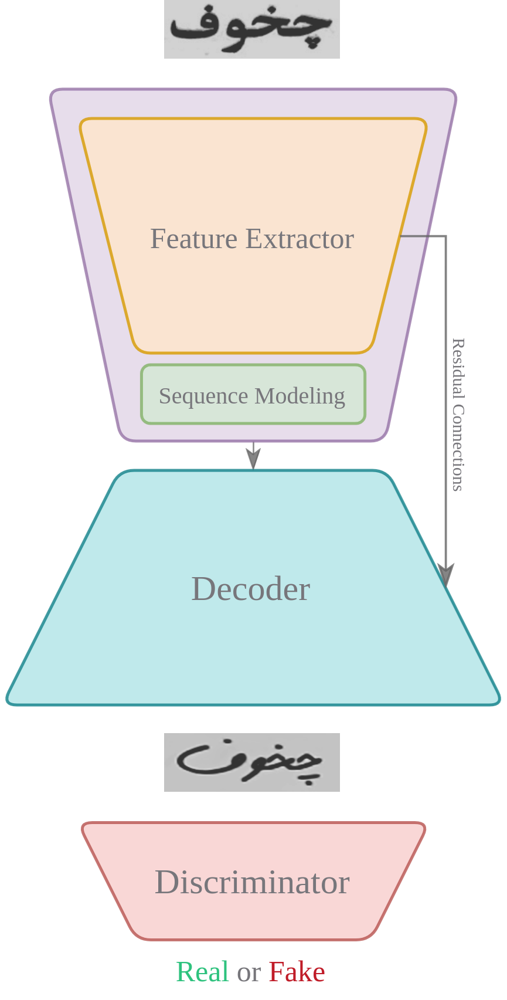
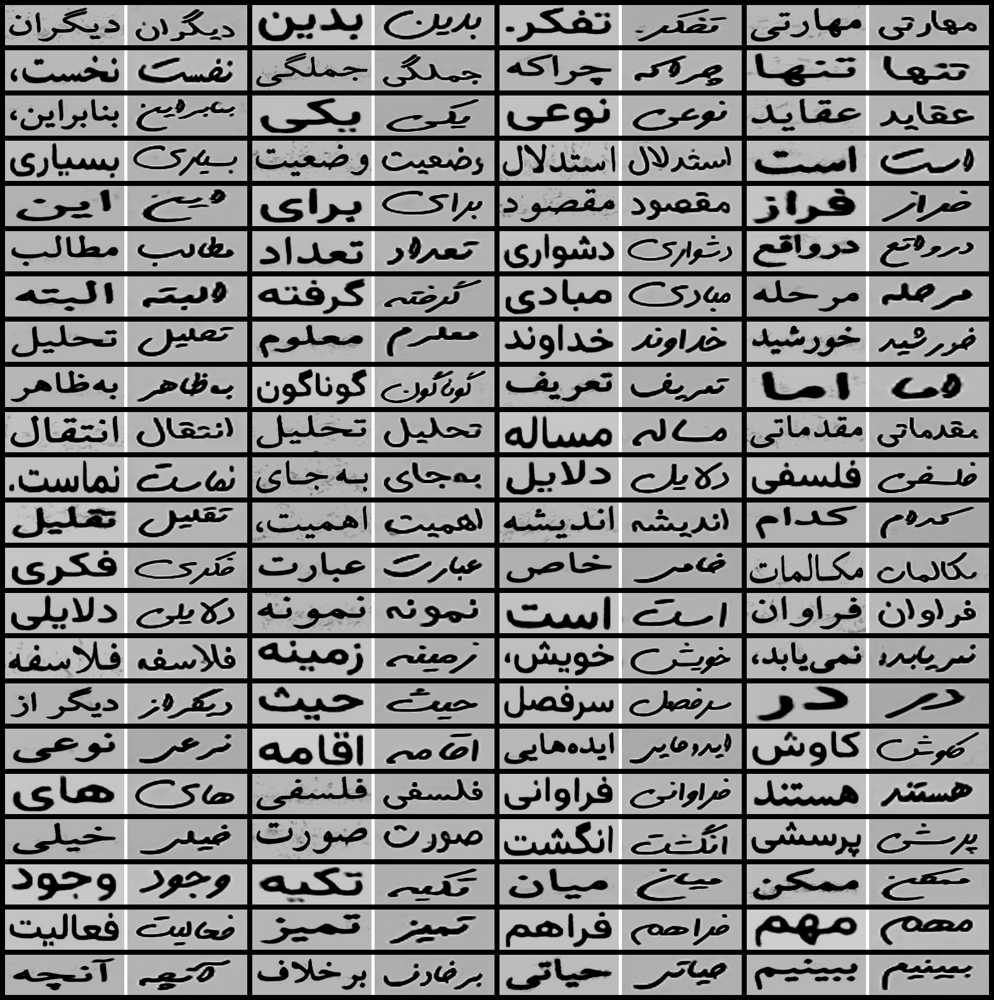

<p align="center">
  <h1 align="center">Written Style Transfer</h1>
</p>

<p align="center">
Convert Typed Text-Image Into Handwritten Style Using Adverserial Methods
</p>


#### **Quick Links**
- [Dependencies](#Dependencies)
- [Architecture](#Architecture)
- [Getting Started](#Getting-Started)
- [Training](#Training)
- [Prediction](#Prediction)
- [License](#License)

## Dependencies
- Install Dependencies `$ pip install -r requirements.txt`
- Download Pretrained Weights [Here]()

## Architecture
<div align="center">
  
  <div align="center"><figcaption><strong>Fig. 1: Model Architecture.</strong></figcaption></div>
</div>

## Getting Started
- Project Structure
```
.
├── src
│   ├── nn
│   │   ├── Decoder.py
│   │   ├── Discriminator.py
│   │   ├── Encoder.py
│   │   ├── Layers.py
│   │   └── Unet.py
│   └── utils
│       ├── DataProvider.py
│       ├── Losses.py
│       ├── misc.py
│       └── transforms.py
├── config.py
├── prediction.py
└── train.py
```

## Training

<div align="justify">
  <h3> Intensity Loss: </h3>
  <p align="justify"> The intensity loss is used to capture the pixel-wise differences between the predicted frame $\ \hat{I}      _{t+1}$ and the ground truth       future frame $\ I_{t+1}$. It is typically computed using an $\ L2$ norm (Mean Squared Error) or $\ L1$ norm (Mean Absolute Error).</p>
  <p align="justify"><strong> Mathematical Formulation </strong> Given the predicted frame $\ \hat{I}_{t+1}$ and the ground truth frame $\ I_{t+1}$, the intensity    loss $\ L_{intensity}$ can be defined as: $\ L_{\text{intensity}} = \| \hat{I}_{t+1} - I_{t+1} \|_p$ </p>
  <p align="justify"> where $\ \| . \|_p$ denotes the  $\ L_p$ norm, commonly $\ p = 2$ ($\ L2$ norm) or $\ p = 1$ </p>
  <p> <strong>$\ L2$ Norm (Mean Squared Error):</strong> $\ L_{\text{intensity}} = \sum_{i,j} (\hat{I}_{t+1}^{(i,j)} - I_{t+1}^{(i,j)})$ </p>
  <p> <strong>$\ L1$ Norm (Mean Absolute Error):</strong> $\ L_{\text{intensity}} = \sum_{i,j} \left| \hat{I}_{t+1}^{(i,j)} - I_{t+1}^{(i,j)} \right|$ </p>
  <p> By minimizing the intensity loss, the model learns to generate more accurate and realistic predictions of future frames, which is crucial for effective         anomaly detection. </p>
</div>

<div align="justify">
  <h3> Gradient Loss: </h3>
  <p align="justify">The gradient loss encourages the predicted frame to have similar gradient structures to the ground truth frame. This is done by computing the    difference between the gradients of the predicted and ground truth frames.</p>
  <p align="justify"><strong>Mathematical Formulation</strong> Given the predicted frame $\ \hat{I}_{t+1}$ and the ground truth frame $\ I_{t+1}$, the gradient       loss $\ L_{gradient}$ can be defined as: $\ L_{\text{gradient}} = \| \nabla \hat{I}_{t+1} - \nabla I_{t+1} \|_p$</p>
  <p align="justify"> where $\ \nabla$ denotes the gradient operator, and $\ \| . \|_p$ is typically the $\ L1$ norm (Mean Absolute Error).</p>
  <p align="justify">The gradient of an image can be computed in both the x (horizontal) and y (vertical) directions. Let $\ \nabla_x$​ and $\ \nabla_y$ represent     the gradients in    the x and y directions, respectively. Then, the gradient loss can be expressed as: $\ L_{\text{gradient}} = \| \nabla_x \hat{I}_{t+1} -         \nabla_x I_{t+1} \|_1 +     \| \nabla_y \hat{I}_{t+1} - \nabla_y I_{t+1} \|_1$</p>
</div>

<div align="justify">
  <h3> Combined Loss: </h3>
  <p align="justify"> In practice, the gradient loss is combined with other loss components, such as intensity loss and adversarial loss, to form a comprehensive     loss function. This combined loss ensures that the predicted frames are not only accurate in terms of pixel values but also maintain structural and contextual      consistency. The total loss function might be expressed as: $\ L_{\text{total}} = \alpha L_{\text{intensity}} + \beta L_{\text{gradient}} + \gamma                  L_{\text{adversarial}}$</p>
  <p align="justify"> where $\ \alpha$, $\ \beta$, and $\ \gamma$ are weighting factors that balance the contributions of the different loss components.</p>
</div>

## Prediction
<div align="center">
  
</div>

## 🛡️ License <a name="license"></a>
Project is distributed under [MIT License]()
